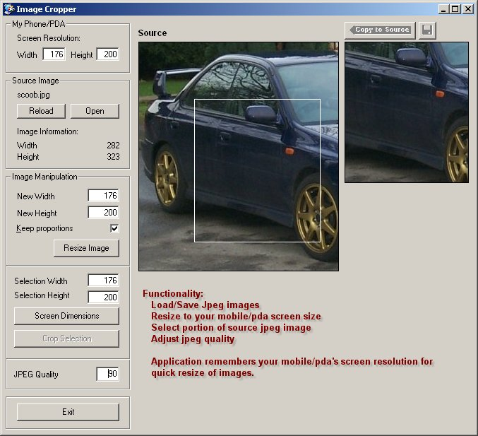



## Got a picture mobile/pda? You need Image Cropper

### Description

I've just got a Sharp GX20 mobile phone and it's an ar$e loading pics into PSP to resize and crop them. Okay, I didn't *need* to write this, but it was a good challenge for me. Load up your jpgs and resize them and crop select areas to your hearts content and save them. hope you enjoy.
 
### More Info
 

             |
---                |---
**Submitted On**   |2003-09-09 14:03:34
**By**             |[Fosters](https://github.com/Planet-Source-Code/PSCIndex/blob/master/ByAuthor/fosters.md)
**Level**          |Advanced
**User Rating**    |4.8 (19 globes from 4 users)
**Compatibility**  |VB 4\.0 \(32\-bit\), VB 5\.0, VB 6\.0
**Category**       |[Complete Applications](https://github.com/Planet-Source-Code/PSCIndex/blob/master/ByCategory/complete-applications__1-27.md)
**World**          |[Visual Basic](https://github.com/Planet-Source-Code/PSCIndex/blob/master/ByWorld/visual-basic.md)
**Archive File**   |[Got\_a\_pict1643799102003\.zip](https://github.com/Planet-Source-Code/fosters-got-a-picture-mobile-pda-you-need-image-cropper__1-48389/archive/master.zip)

